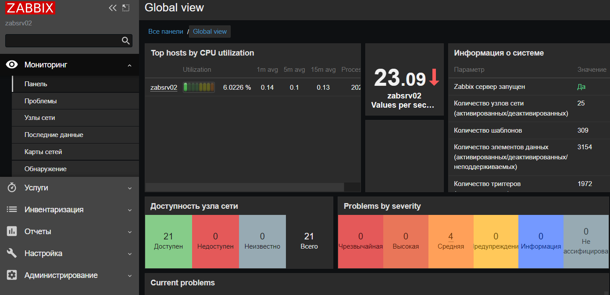
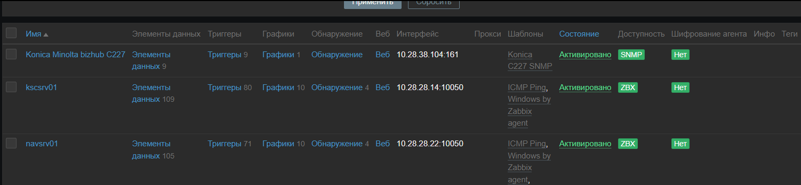
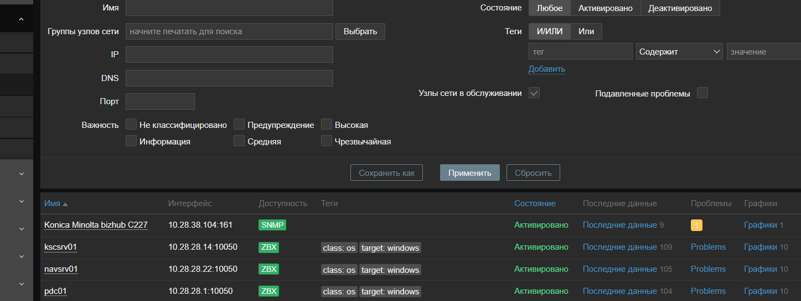
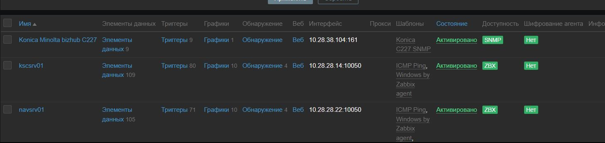
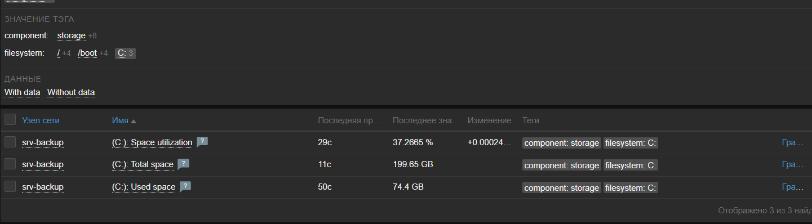

# Домашнее задание к занятию "9.2. Zabbix часть 1"

---

1. Чем Zabbix может помочь в решении ваших задач?  
> Система мониторинга с возоможностью оповешения по различным каналам. Также как система для анализа и коориляция метрик с хостов. Система для визуализации состояния хостов на дашборды. 
2. Установите Zabbix Server с веб-интерфейсом.  
> 
3. Установите Zabbix Agent на два хоста.
> 
> 
> 
4. Установите Zabbix Agent на Windows компьютер и подключите его к серверу Zabbix.
> 